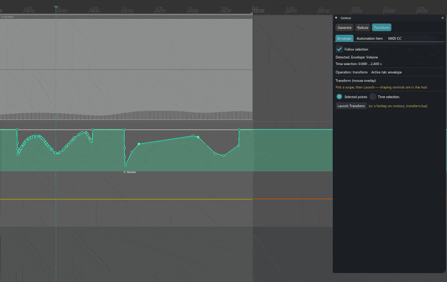
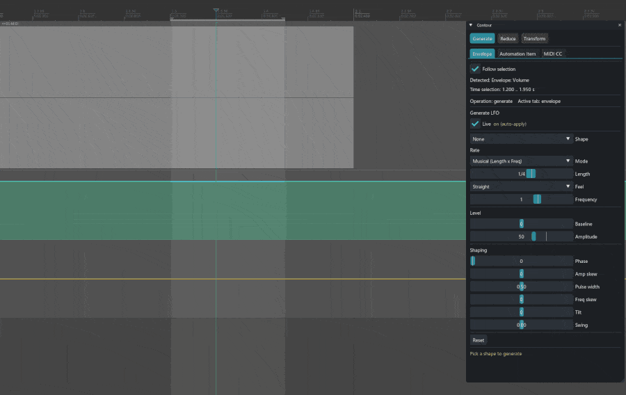
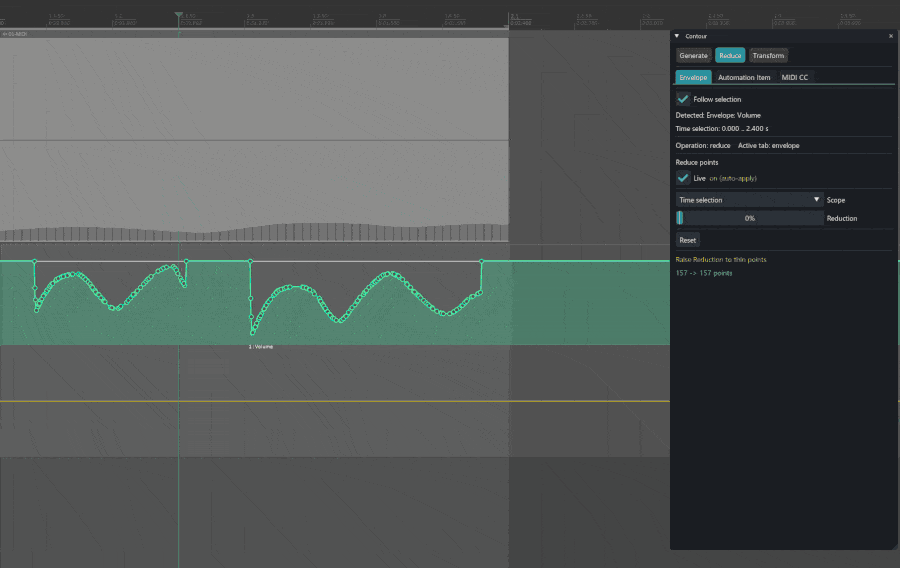

# Contour

**A unified LFO / point-reduce / transform toolkit for REAPER — one panel for track envelopes, automation items, and MIDI CC.**

Contour replaces a pile of scattered modulation and shaping tools with a single [ReaImGui](https://github.com/cfillion/reaimgui) window built around three operations over three targets:

| Operation | What it does |
|-----------|--------------|
| **Generate** | Draw LFO shapes (sine, square, saw, triangle, parametric, …) onto the target, with a live, non-destructive preview that matches REAPER's native CC LFO. |
| **Reduce** | Thin point density with an adjustable tolerance — live and non-destructive. |
| **Transform** | A mouse overlay to **stretch / scale / compress / warp / tilt / reverse / flip** the selected points (or a time selection) directly under the cursor. |

All three work on **track envelopes**, **automation items**, and **MIDI CC**.

## In action

**Transform** — grab the colour-coded handles on the shape and drag (stretch / scale / warp / tilt):



**Generate** an LFO with a live preview, and **Reduce** point density non-destructively:





The same panel follows your context and works identically on automation items and MIDI CC.

---

## Requirements

REAPER 7+ with three extensions (all free, all installed via ReaPack):

| Extension | Needed for | Where |
|-----------|-----------|-------|
| **ReaImGui** | the panel UI (everything) | ReaTeam Extensions repo (bundled with ReaPack) |
| **js_ReaScriptAPI** | the Transform overlay | ReaTeam Extensions repo |
| **SWS** | the Transform overlay | <https://www.sws-extension.org> |

These are **not** bundled with Contour — see [Installing the dependencies](#installing-the-dependencies). If one is missing, Contour tells you which and how to get it.

---

## Install (via ReaPack)

1. In REAPER: **Extensions → ReaPack → Import a repository…**
2. Paste this URL:
   ```
   https://github.com/dtrebjesanin/reaper-contour/raw/master/index.xml
   ```
3. **Extensions → ReaPack → Synchronize packages**, then find **Contour** in **Browse packages** and install it.

This installs two actions (see below) plus all of Contour's internal modules in one go.

### Installing the dependencies

Open **Extensions → ReaPack → Browse packages** and install:

- **ReaImGui: ReaScript binding for Dear ImGui** — from the default *ReaTeam Extensions* repository.
- **js_ReaScriptAPI: API functions for ReaScripts** — same repository.
- **SWS/S&M Extension** — from <https://www.sws-extension.org> (a normal installer, not ReaPack).

---

## The two actions

After installing, search the **Actions** list (Actions → Show action list) for:

- **Script: Contour** — the main panel. Run it to open the window.
- **Script: Contour Transform** — the mouse-overlay tool. You can launch it from the panel's *Transform* tab, run it directly, or **bind it to a hotkey**. (A MIDI-Editor hotkey is handy, since Transform also works on CC lanes.)

---

## Usage

**The active target follows what you're working on.** Select an envelope or automation item in the arrange, or select CC points in the MIDI editor, and Contour switches to that target automatically (you can also pick the tab manually or turn off *Follow selection*).

- **Generate** — pick the target, choose a shape + rate + amplitude (+ phase, swing, skew…), watch the live preview, then apply. Output replaces the selection/time range.
- **Reduce** — choose a scope (time selection / whole item / selected points) and drag the amount; the preview thins the points live. 0% restores the original.
- **Transform** — make a selection (points or time), launch the overlay, and drag the on-shape handles:
  - **↔ Stretch** (horizontal), **↕ Scale / Compress** (vertical, via the Curve knob), **✕ Warp** (push a region in X and/or Y), **↻ Tilt**.
  - **Mouse wheel** = Curve · **Middle-click** = Power/Sine · **Right-click** = Symmetrical.
  - **Reverse / Flip / Reset** buttons in the overlay HUD. Each drag is one undo step.

---

## Troubleshooting

- **"Contour needs …" dialog on launch** — install the named extension via ReaPack (see above), then restart REAPER.
- **The Transform "Launch" button says it can't find the action** — run *Contour Transform* once from the Action list (that registers it), then use the panel button again.
- **Wrong target detected** — Contour follows window focus and selection. Click the surface you want (the envelope lane, or the CC lane), or pick the tab manually.

---

## Credits

- **Transform** is an original re-imagining of the mouse-editing workflow popularized by **juliansader's _js_Mouse editing — Multi Tool_** — built from scratch on a different engine so it stays smooth on envelopes and automation items, not only MIDI CC.
- The **native CC LFO match** was reverse-engineered empirically from REAPER's own output and locked with integer-exact test fixtures.
- Built with **[ReaImGui](https://github.com/cfillion/reaimgui)**, **js_ReaScriptAPI**, and **SWS**, and packaged with **[ReaPack](https://reapack.com)** — all by cfillion and the REAPER community.

No third-party code is copied into Contour; it builds on shared techniques, APIs, and reverse-engineered facts.

---

## License

[GNU General Public License v3.0](LICENSE) (or later). You're free to use, study, share, and modify Contour; modified versions you distribute must stay open under the GPL.

---

## For developers

The repository ships only the `Contour/` folder via ReaPack. The rest is development-only and **not** installed:

- `dev/` — diagnostic scripts (coordinate dumps used while reverse-engineering REAPER's coordinate frames).
- `tests/` — headless test suite. Run with a standalone Lua 5.4 from the repo root:
  ```
  lua tests/test_<name>.lua      # e.g. lua tests/test_transform.lua
  ```
- `docs/` — design specs and implementation plans.

`index.xml` is generated automatically by `.github/workflows/deploy.yml` on every push to `master`; don't hand-edit it. To cut a release, bump `@version` and add a `@changelog` line in `Contour/contour.lua`, then commit and push.
